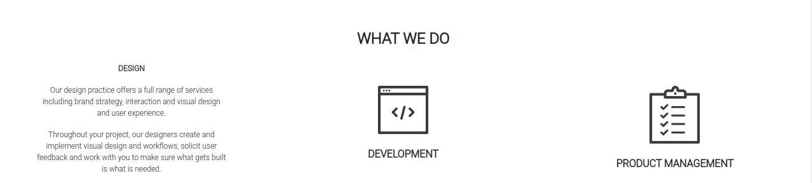
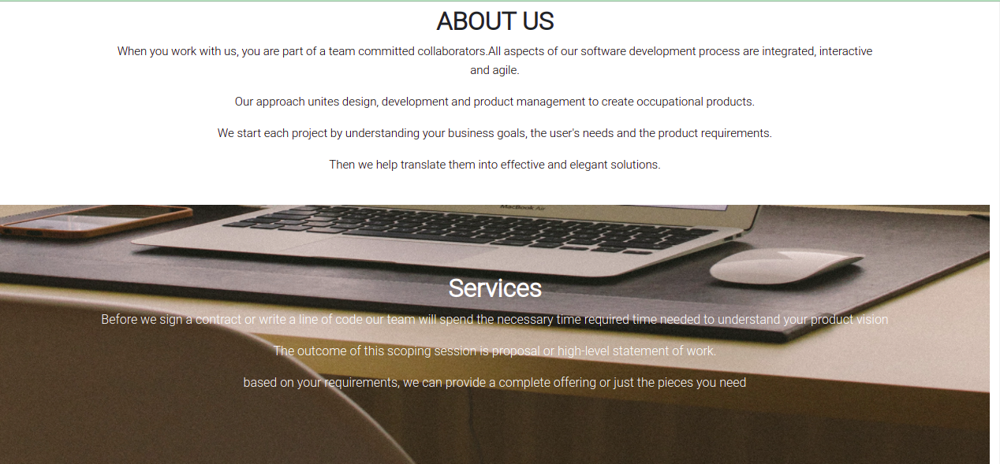
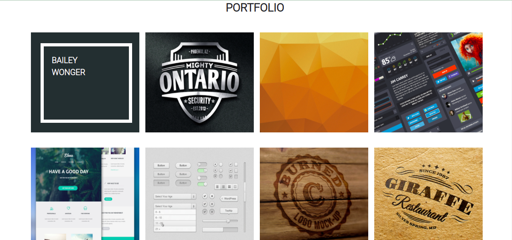

# Delani Studio

##### Reuben Kipkemboi.

## Table of Content

- [Description](#Description)
- [Installation Requirement](#Installation)
- [Technology Used](#technologies-used)
- [License](#license)
- [Authors Info](#authors-info)

# Description.

A Delani studio website that highlights the various tasks and services done by Delani studio. It consists of the past projects done and completed by Delani studio Delani studio is a software development company that majors on the following services;

<ul>
<li>Software design</li>
<li>Software development</li>
<li>Product Management</li>
</ul>

Comprised of the following sections

- Landing section with a logo and slogan of the company.
- What the company does and is included in a "What we-do" section.
- Services section inclusive of the services offered by the company.
- Portfolio-section which entails the projects that the company ahs done with various customers.
- A Contact form where users can contact the company incase of any queries and appointments.

#### Welcome section

#### What-we-do

#### About us and Services Section.

#### Portfolio

## Installation

- A device that can connect to the internet.
- Internet connection.

[Go Back to the top](#delani-studio)

## Technologies Used

- HTML -To structure the layout of the page.

- CSS and Bootstrap - To style the webpage and and enhance user-friendliness.

- JavaScript and JQuery Library - To enhance dynamic interaction of the user with the page thus improving user experience.

[Go Back to the top](#delani-studio)

## License

[MIT License](LICENSE)

## Authors Info

- Slack - [Reuben Kipkemboi](https://moringaclassroom.slack.com/team/U02UL5H6GQY)

- Email - [Reuben Kipkemboi](https://gmail.com)

# live site

- #### https://reuben-kipkemboi.github.io/Delani-Studio/
